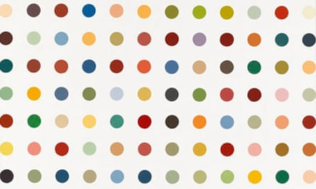

# Million Dollar Painting Project 🇨🇴 🐕🐶

Welcome to my **Million Dollar Painting** project! Inspired by Damien Hirst's spot paintings, I used Python's **Turtle graphics** library to create a colorful and vibrant masterpiece. This project was built to explore the use of randomness and color theory in art, with a little help from my four-legged friends! 🎨✨

## 🐾 About My Dogs

This artwork is inspired by **Dante** and **Kira**, my beloved dogs who each have their own unique personality. Their playful nature and colorful characters are captured through the random colors and patterns in the painting. From concentric circles to rows of colorful dots, every run of the script reflects a bit of their fun-loving spirit! 🐶💫

## 🚀 About the Project

This project simulates a colorful and dynamic art piece using concentric circles and rows of vibrant dots. Every time you run the script, the colors and shapes will change, making each piece unique!

## 🛠️ Technologies Used

- **Python** (with Turtle graphics)
- **colorgram**: Extracts color palettes from images
- **Turtle Graphics**: The classic Python library for drawing.

## 🎨 Installation

1. Clone this repository:
    ```bash
    git clone https://github.com/SebastianDiazSD/100-python-projects-challenge.git
    ```
2. Install the required dependencies:
    ```bash
    pip install colorgram.py
    ```

## 💻 How to Run

1. Download the `colors.png` image (or provide your own) to be used for color extraction.
2. Run the Python script:
    ```bash
    python million-dollar-painting.py
    ```

This will open a **Turtle graphics** window where the painting will be drawn. Click anywhere to exit.

## 📸 Example

Here's a preview of how the generated artwork might look:



---

Feel free to fork, modify, and share your version of the painting!

